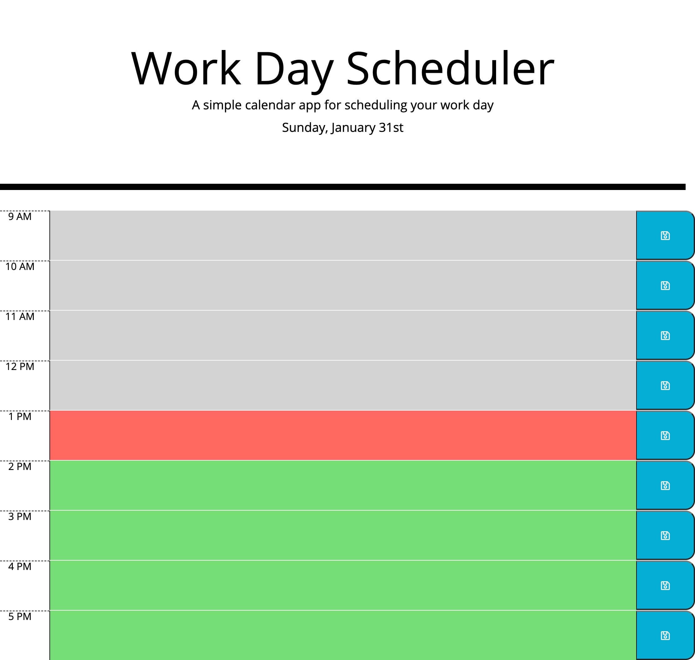
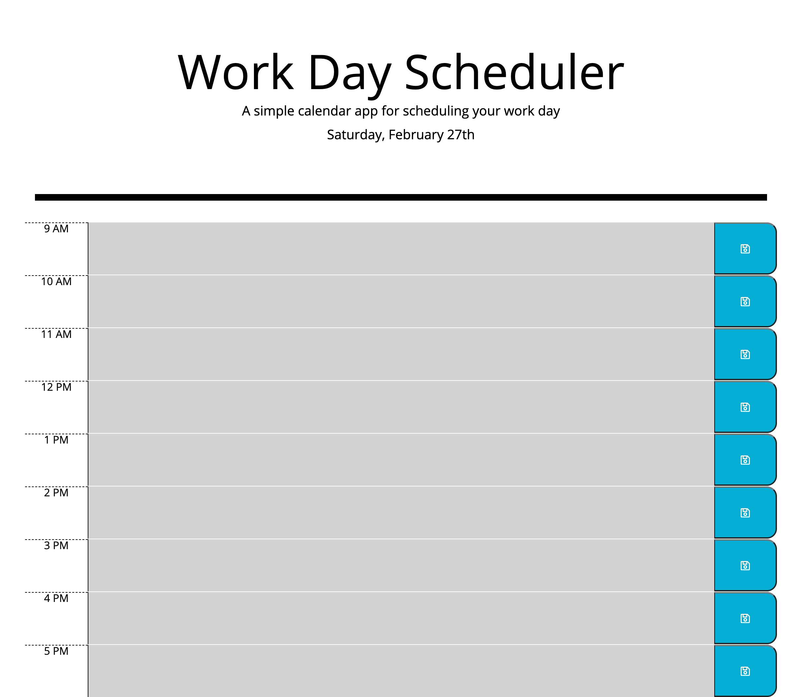

# Workday-Scheduler

## Description 

This application assists individuals with their daily schedules by providing an easy to use application that tracks hourly tasks and shows what tasks are past the current hour. The application resets itself after 5 pm for the next business day, making use for the user more convenient.

This application was created to improve my skills in JavaScript and jQuery. As well, it was created for users to easily track their daily schedules.

Through the creation of this application, I was challanged with having one click function in jQuery distinguish what hour slot a save button was related to and saving that information in local storage. I learned this task is easily accomplished with the use of the jQuery ".each" and "this" code.

If I was to update this application in the near future, I would like to create more text slots for each hour to help seperate tasks within the same hour.

To view and use this application, please [click here](https://glchavez.github.io/Workday-Scheduler/).

## Technologies Used

<ul>
<li>HTML</li>
<li>Bootstrap</li>
<li>CSS</li>
<li>JavaScript</li>
<li>jQuery</li>
<li>VS Code</li>
</ul>

## Usage 

To use this application, simply click on the text area in the time slot your event is scheduled for and enter the task. Once entered, click on the save button to save the task. If this task changes or needs to be updated, re-enter the new task and save the update. 

Each hour slot is color coded to represent the status of events. Grey represents past hour slots, red represents the current time slot, and green represents future time slots.

All tasks entered will stay on the schedule for the day and removed once business hours have passed (cleared at 6 pm).

### Work Hours:

### Non-Work Hours:

## Credits

I would like to provide credit to [The Denver Univeristy Coding Bootcamp](https://bootcamp.du.edu/coding/) for providing me with the materials, intstructions, and one-on-one assistance to perform this project.

Recognition is provided to [W3Schools](https://www.w3schools.com/) for providing me with resources to better understand JavaScript and jQuery concepts and how to implement them. I would also like to give credit to [Scrimba](https://scrimba.com/scrim/cwpDGhG) for providing a basic tutorial of Moment.js.

## Contact Information

To contact me, please feel free to email me at giochavez320@gmail.com.

## License

MIT License

Copyright &copy; 2021 Giovany Chavez

Permission is hereby granted, free of charge, to any person obtaining a copy
of this software and associated documentation files (the "Software"), to deal
in the Software without restriction, including without limitation the rights
to use, copy, modify, merge, publish, distribute, sublicense, and/or sell
copies of the Software, and to permit persons to whom the Software is
furnished to do so, subject to the following conditions:

The above copyright notice and this permission notice shall be included in all
copies or substantial portions of the Software.

THE SOFTWARE IS PROVIDED "AS IS", WITHOUT WARRANTY OF ANY KIND, EXPRESS OR
IMPLIED, INCLUDING BUT NOT LIMITED TO THE WARRANTIES OF MERCHANTABILITY,
FITNESS FOR A PARTICULAR PURPOSE AND NONINFRINGEMENT. IN NO EVENT SHALL THE
AUTHORS OR COPYRIGHT HOLDERS BE LIABLE FOR ANY CLAIM, DAMAGES OR OTHER
LIABILITY, WHETHER IN AN ACTION OF CONTRACT, TORT OR OTHERWISE, ARISING FROM,
OUT OF OR IN CONNECTION WITH THE SOFTWARE OR THE USE OR OTHER DEALINGS IN THE
SOFTWARE.